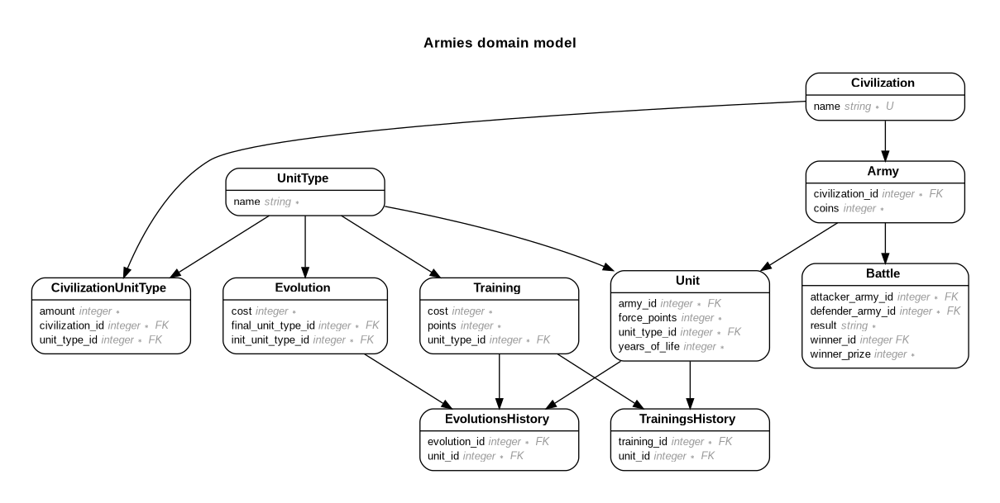

# Armies model data

This repo contains the data modelling for the armies problem. The model schema can be found in db/schema.rb, and a possible seed file in db/seeds.rb.  

You can run the following commands to query the database.

```
bundle exec rails db:create
bundle exec rails db:migrate
bundle exec rails db:seed

bundle exec rails c
```

## Entity-Relationship diagram



## Notes
 - The initial unit config from each civilization is defined as a JSON, assuming unit types and its values might change over time. 
 - Defeat and draw battles criteria are not defined into the Battle model. Might consider implementing service classes for both requirements. 
 - Both History models are suggestions to add to the armies’ domain model, although they are not used in the seeds file.
